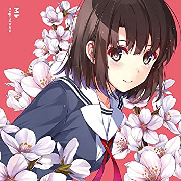
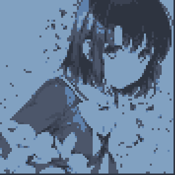
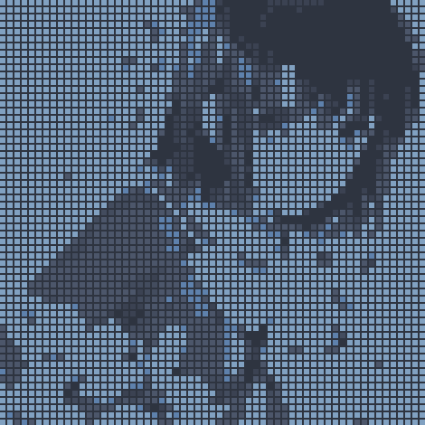

# Nordot

Convert images to pixel art using [Nord](https://github.com/nordtheme/nord) color scheme (blue and black palette)

default


dot


dot grid


## Installation

```bash
pip install Pillow numpy
```

## Usage

```bash
python nordot.py <input_image> [output_image] [pixel_size] [gap_size]
```

### Examples

```bash
# Basic conversion
python nordot.py photo.jpg

# Specify pixel size
python nordot.py photo.jpg output.png 16

# Add gaps between blocks (grid style)
python nordot.py photo.jpg output.png 8 2
```

## Parameters

- **input_image**: Image file to convert (required)
- **output_image**: Output path (default: `nord_pixel_art.png`)
- **pixel_size**: Block size for pixelation (default: `8`)
- **gap_size**: Gap between pixel blocks (default: `0`, recommended: `1-3`)

## Color Palette

Uses 6 colors from Nord color scheme:
- Nord0-3: Polar Night (4 dark colors)
- Nord9-10: Frost (2 blue colors)
